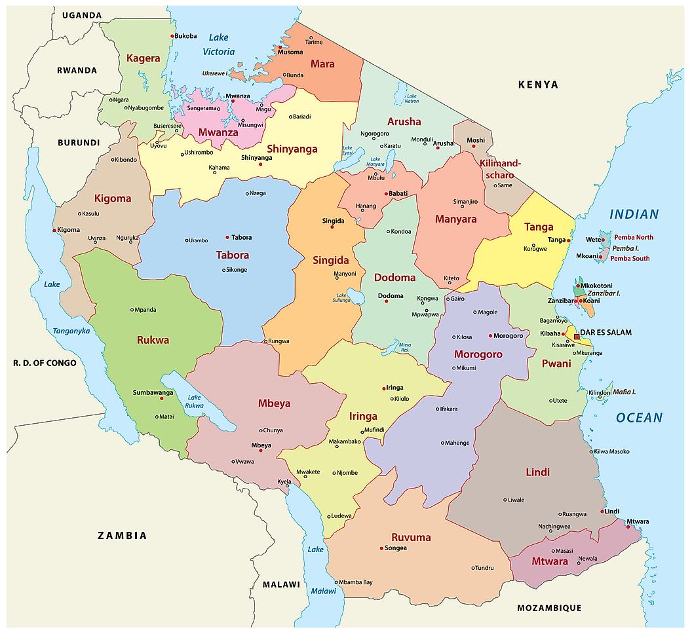

# Tanzania Waterpoint Map Analysis for WaterAid


**Author**: [Mohammed Siddiqui](mailto:siddiqui.mohammed.m@gmail.com)

## **Overview**
 
This project will be using the Tanzania Waterpoint Mapping data released in 2012. The dataset is from an active competition on datadriven.org.

## **Business Problem**


Due to geography, Tanzanians do not have easy access to water.  Many waterpoints have been built over the years, but a large number of them are in dire need of repair.  Our goal with this project is to aid in targeting our resources in areas that need the most help.

In order to accomplish our goal, we will create a model to predict if a waterpoint is in need of repair given a set of features.  Based on our model and analysis, we can determine which factors are correlated with waterpoint failure.




## **Data**

The main source of data we will work with is the King County Housing dataset.
    train_values.csv
    train_labels.csv


## **Methods**

For the purposes outlined above, we will use a variety of methods and modules:

* Numpy
* Scipy
* Pandas
* Matplotlib
* Seaborn
* Sklearn
* Xgboost

## **Results**

### **Water Quantity**
Waterpoints labeled as 'dry' or 'unknown' need the most repair.


### **Payment Type**
The highest repair needs are at waterpoints where no payments are collected or the payment situation is unknown.


### **Region**

Lindi and Mtwara, located in the southeast, have a very high proportion of waterpoints in need of repair.


### **Local Government Authority**

Of special interest are certain LGAs in areas without enough water.  These are the top 20 LGAs with the highest repair needs.  All of them have over 80% waterpoints in need of repair.


## **Conclusions about Model**

* Our best model was correct in guessing the status of the waterpoint about 80.6% of the time. While this is not ideal, I am happy with the results based on the time allotted for this project as well as shortcomings in the dataset.

* The precision of our model in finding waterpoints in need of repair was 0.84. This means that our model correctly labeled 84% of the waterpoints in need of repair.

* The recall of our model was 0.71 which was quite lower than our precision score. In layman's terms, if we sent someone to a location where this model indicated a need for repair, the waterpoint would be in need of repair 71% of the time.

* There is a delicate balance between precision and recall where increasing one decreases the other. In this case, where lack of water can mean the difference between life or death, having a higher sensitivity(precision) is of more benefit. In those 29% of cases where the waterpoint is still funcitoning when someone goes to check on it, it would advisable to run a further inspection to see if the waterpoint will need repair soon.

## **Next Steps**

* I would like to do something about the 0 values for latitude and longitude. Taking the mean lat/long for that particular LGA or Ward and assigining it to the 0 value makes most sense to me.

* Figure out how to separate the urban areas from the rural areas.

* The construction dates would be useful if we had the values for all waterpoints in order to calculate age, which is obviously a very important factor. Another feature that would be of great value would be records about maintainance/repairs.

## **For More Information**

See the full analysis in the [Jupyter Notebook](tanz_well.ipynb) or review this [presentation](tanz_wp_pres.pdf).

For additional info, I can be reached at  at [siddiqui.mohammed.m@gmail.com](mailto:siddiqui.mohammed.m@gmail.com)

Having trouble loading the notebook? [Jupyter Nbviewer link](https://nbviewer.jupyter.org/github/saifword/Tanz_well_predict/blob/main/tanz_well.ipynb)

More information from [Us Aid](https://pdf.usaid.gov/pdf_docs/PA00WH9Z.pdf)

## Repository Structure

```
├── data
├── images
├── README.md
├── tanz_wp_pres.pdf
└── tanz_well.ipynb
```